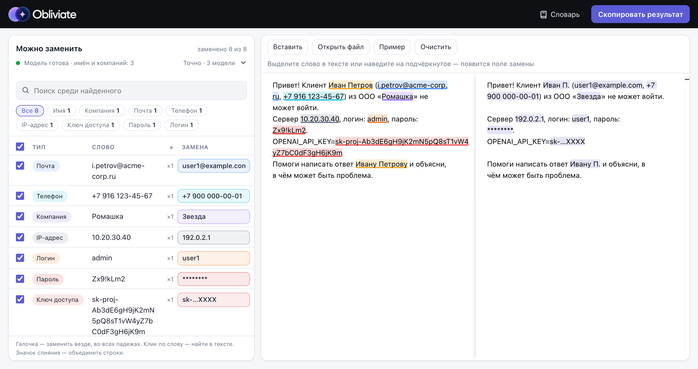

<p align="center"></p>

<p align="center"><b><a href="https://and-sheera.github.io/obliviate/" target="_blank">Демо →</a></b></p>



# Obliviate

Помогает убрать из промпта для нейросети то, что вы не хотите ей показывать, заменив это на что-то своё:
«Иван Иванов» → «Иван И.», «Сбербанк» → «Комбанк», ключ API → `sk-…XXXX`. Приложение подсказывает, что стоит заменить, но **само ничего не меняет**.
Статическое веб-приложение: **всё считается в браузере, на сервер ничего не уходит** (строгий CSP `connect-src 'self'`).

```
«Иван Иванов из Сбербанка просил ключ sk-proj-…»  ──►  вы отмечаете и пишете замены  ──►  «Иван И. из Комбанка просил ключ sk-…XXXX»  ──►  нейросеть
```

## Как пользоваться
1. Вставьте текст. Слева оригинал (его можно править), справа то, что уйдёт в нейросеть; пока вы ничего не отметили, они одинаковые.
   Найденное (имена, компании, почты, ключи…) подчёркнуто цветом по типу и собрано в список «Можно заменить».
2. Отметьте, что заменить и на что. Три способа, везде одно и то же поле «Замена» с заготовкой (имя → инициалы, почта → `user1@example.com`, ключ → `sk-…XXXX`; компанию и место придумываете вы):
   - галочка в строке списка или сразу текст в поле «Замена» (Tab в пустом поле принимает заготовку);
   - наведите мышь на подчёркнутое слово: подсказка с полем замены, «Не заменять», «Все места», другой тип;
   - выделите любой фрагмент: подсказка с полем замены и выбором типа (Alt+Enter — то же с клавиатуры).
   Замена действует **во всех местах и падежах**: «Сбербанк → Комбанк» даёт «из Комбанка», «Иван Иванов → Иван И.» даёт «Ивану И.». Заменённое залито цветом, справа замены подсвечены.
3. **Скопировать результат** (кнопка в шапке). Если остался незаменённый секрет (ключ, пароль), приложение переспросит.

Список «Можно заменить»: под словом видны все его формы в тексте («Ивану · Иваном»), клик по слову показывает все его места (↑ ↓ или J K листают, Esc закрывает), есть поиск, фильтр по типу, сортировка, общая галочка «заменить все показанные». По умолчанию сверху то, в чём приложение уверено больше всего: ваш словарь, затем найденное правилами (почта, ключи, ООО «X»), затем находки модели — от тех, с которыми согласны все модели.

**Похожие строки** — вероятно, опечатки одного и того же («Зина» / «Зида», «Иванов» / «Ивонов»: в каждом слове не больше одной буквы разницы) — стоят рядом: под первой — похожие на неё. Чтобы объединить, отметьте значком слияния справа от слова (виден при наведении) две строки или больше — внизу списка появится «Объединить»; строки присоединяются к верхней из выбранных, после этого одна строка и одна замена на все написания и падежи, «разделить» возвращает как было. Два разных известных имени («Ваня» / «Таня») похожими не считаются. Объединить можно и любые строки, не только похожие («СНК» и «СМД», «Сбер» и «Сбербанк»).

**Просто имена.** «Даня», «Лёха», «Иван И.» — по одному имени человека не узнать, а замена «Д.» только запутает нейросеть. Такие строки стоят ниже разделителя «Просто имена», в тексте подчёркнуты блёкло, общая галочка их не трогает; заменить можно, отметив вручную. Имя с фамилией или отчеством («Иван Иванов», «Георгий Павлович») и незнакомое слово остаются в основном списке.

**Что запоминается.** Текст, замены в нём и найденное моделью (повторно анализировать не нужно) переживают перезагрузку страницы: они лежат в IndexedDB этого браузера, **открытым текстом**, и никуда не отправляются. «Очистить» стирает их; новый текст, «Вставить» или «Пример» начинают с чистого листа.
**Словарь замен** (кнопка «Словарь» или «и в словарь замен» в подсказке) применяется к любому тексту сразу, в конкретном тексте замену можно снять галочкой.
Словарь и режим модели лежат в `localStorage`.

## Что находится
| Как | Что |
|---|---|
| Регулярки | API-ключи (OpenAI, Anthropic, AWS, GitHub, Slack, Google, Stripe, GitLab, npm, SendGrid, HF, Telegram-бот), JWT, Bearer/Basic, PEM-ключи, логины и пароли в `URL`, `key=value`, JSON/YAML/.env, SQL, `curl -u`, «пароль от X: …»; email, телефоны (РФ и международные), Telegram; IPv4/IPv6, MAC, внутренние хосты `*.local/.internal/.corp/.lan` |
| Эвристики по форме | `ООО «Ромашка»`, `ПАО Сбербанк`, «компании Ланит», `Иванов И.И.`, `И.И. Иванов` |
| Словарь и ручное выделение | любые ФИО, компании, проекты; находит **все падежи** (`Иванов`, `Иванову`, `Ивановым` — одна строка, одна замена) |
| Языковая модель (скачивается один раз, потом из кеша браузера) | русские ФИО и организации, в Web Worker. Режим выбирается в строке состояния модели над списком: **Точно** (по умолчанию) — три модели, слово предлагается, если его нашли две из трёх, 154 МБ, анализ втрое дольше; **Быстро** — одна модель `rubert-tiny2` в int8, 31 МБ |

Не входит в v1: номера карт, ИНН/СНИЛС/паспорт, адреса, счета/IBAN.

## Ограничения (важно знать)
- **Словарь замен лежит в `localStorage` открытым текстом** (что → на что). Кто получит доступ к профилю браузера, тот его прочтёт. Тексты и решения по ним не сохраняются.
- Это замена, а не анонимизация: по контексту («директор единственного завода в Урюпинске») человека всё равно можно узнать.
- Склонение без морфологии: окончание переносится, только если замена склоняется так же, как оригинал (`Сбербанк/Комбанк`, `Ромашка/Звезда`). Иначе замена остаётся в той форме, в которой вы её написали («из Вектора» → «из Альфы», но «Вектору» → «Альфы»). Пишите замену в той форме, в которой слово показано в списке.
- Языковая модель знает только кириллицу. Английские имена и компании отмечайте выделением или словарём. Если что-то не находится, выделите вручную.
- Предлагаются и известные люди и бренды («Расскажи о Пушкине»): отличить общий вопрос от личного контекста нельзя. Не хотите менять — не отмечайте.
- Словарь не учитывает регистр: термин «Вектор» найдёт и слово «вектор».
- Регулярки ориентируются на формат, поэтому возможны лишние подсказки (например, `@handle` без `_`/цифр не считается Telegram-ником) и пропуски.

## Разработка
```bash
npm install
npm run dev          # http://localhost:5173
npm test             # корпус и unit-тесты (без модели), ~0.3 с
npm run test:ner     # качество NER на настоящей модели (Node): полнота ФИО ≥ 90 %, организаций ≥ 85 %, точность ≥ 90 %, ≥ 95 % обычных текстов без ложных скрытий
npm run build        # dist/ (CSP прописывается только в сборке)
npm run preview      # проверить сборку
```
Разработка шла по TDD: сначала [`tests/corpus.ts`](tests/corpus.ts) (текстовые кейсы вида «что обязано найтись / что не должно»,
плюс ложные срабатывания: версии, UUID, хэши, `example.com`, декораторы и т. д.), потом код. Каждый кейс проверяется так: заменить всё найденное
([`tests/all.ts`](tests/all.ts)) — и ничего из «обязано найтись» не осталось, а «не должно» осталось. Есть и общий тест «весь корпус одним сообщением».
Реальные тексты (письма, чаты, договоры, промпты и обычные тексты, где предлагать нечего) лежат в [`tests/texts.ts`](tests/texts.ts).
Они проверяются дважды: строго без модели (`npm test`) и на модели с порогами (`npm run test:ner`).
Нашли ложное срабатывание или пропуск? Добавьте кейс туда, потом чините.

### Устройство
```
src/core/detect.ts      регулярки и эвристики → спаны; разрешение пересечений (побеждает самый длинный)
src/core/dictionary.ts  словарь с падежами
src/core/mask.ts        collect: всё, что можно заменить
src/core/replace.ts     замена выбранного (replace), перенос падежа на замену (inflect), заготовки (suggest), ключ сущности
src/core/storage.ts     словарь замен в localStorage (и уборка данных первой версии)
src/ner/                Web Worker с transformers.js, агрегация токенов в спаны (aggregate.ts, чистая функция)
public/coi-sw.js        service worker: добавляет COOP/COEP (GitHub Pages их не отдаёт), чтобы модель считала в несколько потоков; при первом заходе одна перезагрузка
src/main.ts             интерфейс: monaco diff (из бандла, не с CDN), список «Можно заменить», подсказки, настройки
```

### Модель
Модели лежат в `public/models/*` (в репозитории), приложение не ходит на huggingface.co. Браузер кладёт их в Cache API и больше не скачивает, поэтому новая версия модели должна лежать по новому пути.

| папка | что это | режим |
|---|---|---|
| `ner` | `r1char9/ner-rubert-tiny-news` (MIT), 31 МБ | Быстро, Точно |
| `ner-c3-v2` | `cointegrated/rubert-tiny2`, дообученная на Collection3 с дополнениями (ниже) и английском CoNLL-2003, 31 МБ | Точно |
| `ner-conv` | `DeepPavlov/distilrubert-small-cased-conversational`, дообученная на Collection3 + обрывках реплик, 92 МБ | Точно |

Дополнения к Collection3 сделаны из неё же, поэтому грамматика в них настоящая:
- **обрывки реплик**: распознавание речи режет предложение на реплики и пишет каждую с заглавной («Пошуршал в логах»), а модель, обученная на новостях, принимает такое слово за имя;
- **фамилия первой**: «Кузнецова Валерия Игоревна», как в документах (в новостях почти всегда «Валерия Кузнецова»);
- **компании в кавычках** без ООО: «работает в «Пятёрочке»»;
- **заголовки**: «Итоги Года: Рост Выручки», «ХАРАКТЕРИСТИКА» — не сущности;
- **английский** CoNLL-2003 (MISC → «не сущность»): `rubert-tiny2` знает английский, и английские имена ничего не стоят по размеру. Латиница принимается только в английских строках и только как `Sarah Connor`, чтобы код и SQL не попадали в находки.
```bash
./scripts/convert-model.sh [hf-model-id|папка] [out-dir]           # нужен python3; ставит torch в .venv-model, кладёт int8-ONNX (по умолчанию в public/models/ner)
python scripts/train_model.py <out>                                # ner-c3-v2 (~7 мин на Mac); для ner-conv добавьте BASE=DeepPavlov/distilrubert-small-cased-conversational CPU=1
npm run test:ner                                                   # пройдёт ли модель планку качества
NER_MODEL=ner,ner-c3-v2,ner-conv npm run test:ner                  # то же для режима «Точно» (модели голосуют)
npm run test:big                                                   # длинные тексты в разных стилях: без модели, «Быстро», «Точно»
```
wasm (~14 МБ) загружается при открытии страницы; ход загрузки и анализа текста по частям показан вверху таблицы «Найдено».

### Деплой
GitHub Pages: `.github/workflows/deploy.yml` (тесты → NER-бенчмарк → сборка → публикация). В настройках репозитория включите Pages → Source: GitHub Actions.
Сборка использует относительные пути (`base: './'`), поэтому работает и на `user.github.io/repo/`. Модели лежат в репозитории без LFS (самый большой файл 92 МБ, лимит GitHub 100 МБ); режим «Точно» при первом запуске скачивает ~154 МБ, дальше они берутся из кеша браузера.
